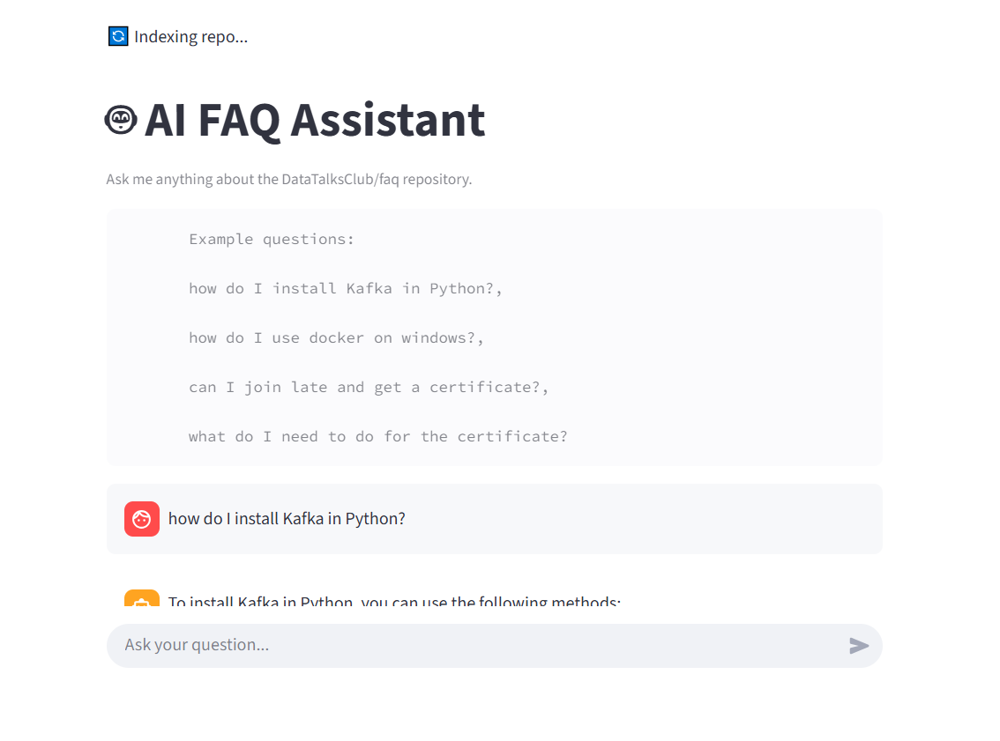
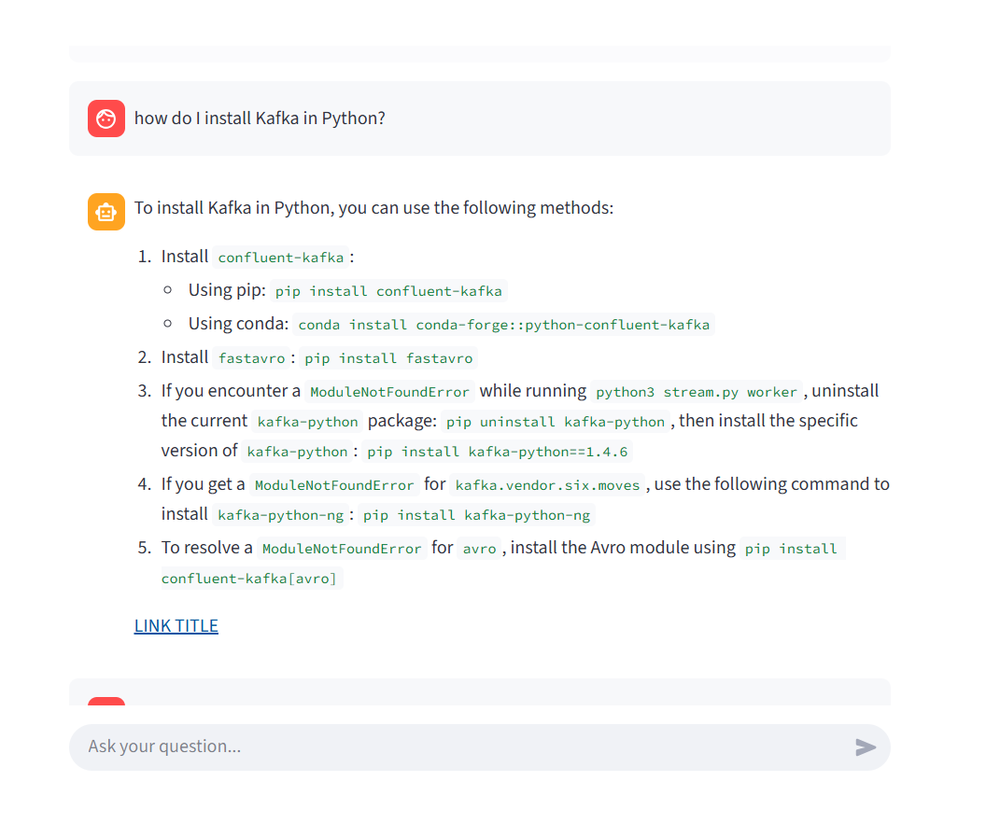
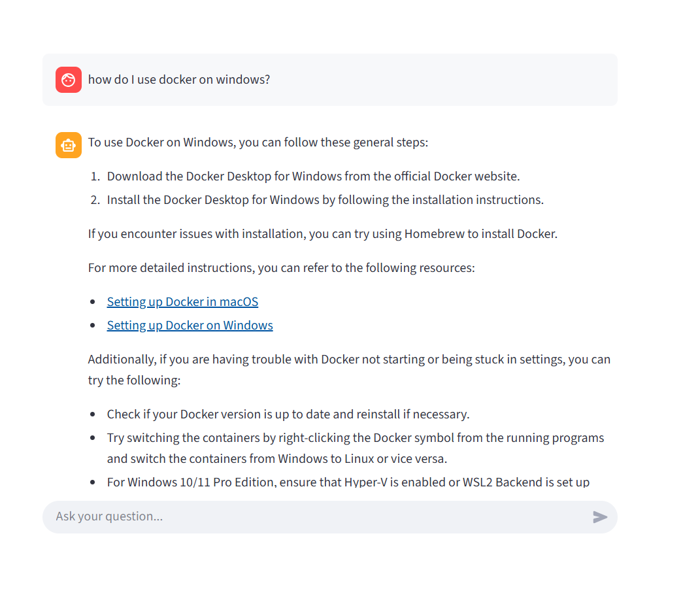

# 7 Days AI Agents Email Crash Course

# AI FAQ Assistant for DataTalksClub

An AI-powered assistant that helps students quickly find answers to FAQ questions from [DataTalks.Club](https://github.com/DataTalksClub/faq) courses.
Built as a project for the [AI Agents Crash Course](https://alexeygrigorev.com/aihero/).

## Overview

This project solves that problem by providing a conversational assistant that:

- Searches the DataTalksClub/faq repository
- Retrieves the most relevant content
- Generates helpful answers with references to the original materials


## Installation

Requirements:

- Python 3.12+
- [uv](https://github.com/astral-sh/uv)

```python
# Make sure you have uv
pip install uv

# Clone this repo
git clone https://github.com/AslauAlexandru/7-Days-AI-Agents-Email-Crash-Course
cd 7-Days-AI-Agents-Email-Crash-Course/

# Install dependencies
uv sync
```


For API key management, we recommend using ```.env```:

```python
GROQ_API_KEY=""
```

## Usage


Set up your Groq API key using OpenAI:

```python
GROQ_API_KEY=""
```

## CLI mode

```python
uv run main.py
```

## Web UI mode

```python
uv run streamlit run app.py
```









This launches a Streamlit app. You can chat with the assistant in your browser.
The app is available at http://localhost:8501.


## Features

- 🔎 Search over FAQ Markdown files with minsearch
- 🤖 AI-generated answers powered by pydantic-ai + Qroq API Key (llama-3.1-8b-instant and/or other llama variant)
- 📂 Direct GitHub references in answers
- 🖥️ Two interfaces: CLI (```main.py```) and Streamlit (```app.py```)
- 📝 Automatic logging of conversations into JSON files (```logs/```)


## Evaluations

We do this in two steps:

- First, we generate synthetic questions (see ```eval_notebooks/data-gen.ipynb```)
- Next, we run our agent on the generated questions and check the criteria (see ```eval_notebooks/evaluations.ipynb```)


## Project file overview

```ingest.py``` - handles data loading and indexing from GitHub repositories

```search_tools.py``` - contains our search tool implementation

```search_agent.py``` - creates and configures the Pydantic AI agent

```logs.py``` - handles logging of conversations

```main.py``` - brings everything together for the command-line interface


## Tests

TODO: add tests

```python
uv run pytest
```
(Currently minimal test coverage; contributions welcome.)


## Deployment

Streamlit Cloud [should understand uv](https://docs.streamlit.io/deploy/streamlit-community-cloud/deploy-your-app/app-dependencies#other-python-package-managers), but it didn't work for me. So I exported the dependencies into ```requirements.txt```:

```python
uv export --no-dev > requirements.txt

```

Make sure it's pushed along with the latest changes.

Next, run the application locally:


```python
uv run streamlit run app.py

```

Click "deploy", connect your GitHub repo, and configure deployment settings.


In the settings, make sure you configure ```GROQ_API_KEY```.


Once configured, Streamlit Cloud will automatically detect changes. It will redeploy your app whenever you push updates.


# Reference

AI FAQ Assistant for DataTalksClub: https://github.com/alexeygrigorev/aihero/tree/main/code


# Registration for the course

You can check the next link, if the link is available. 
If you want to attend at this course, please enter the email here at the [AI Agents Crash Course](https://alexeygrigorev.com/aihero/) link.


